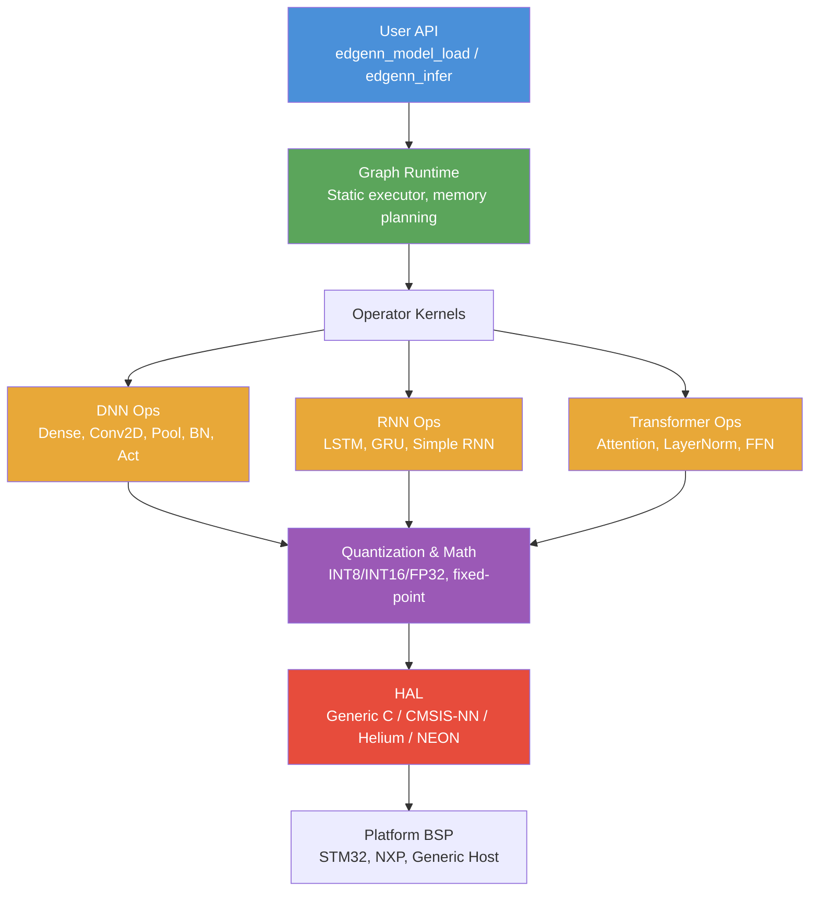

<!-- Build & Quality -->
[](https://github.com/Dimitrios-Kafetzis/EdgeNN/actions/workflows/ci.yml)
[](https://opensource.org/licenses/MIT)
[]()
[]()
[]()
[](CONTRIBUTING.md)
[](https://github.com/Dimitrios-Kafetzis/EdgeNN/stargazers)

<h1 align="center">EdgeNN</h1>

<p align="center">
  <strong>Lightweight, zero-allocation C library for running neural networks on ARM microcontrollers.</strong><br/>
  Supports Dense, Conv, LSTM, GRU, and Transformer architectures with INT8 quantized inference.
</p>

---

## Key Features

- **Zero-malloc inference** — Static arena allocator with save/restore and ping-pong buffers. No heap, ever. Real-time safe.
- **Quantization-first design** — INT8 symmetric with INT32 accumulation and fixed-point requantization. No FPU required on the hot path.
- **18 operators across 4 categories** — DNN (Dense, Conv2D, DWConv, Pool, BN, 6 activations), RNN (LSTM, GRU, Simple RNN), Transformer (Attention, LayerNorm, FFN, PosEnc), and Utility ops.
- **Graph runtime with model loader** — Binary model format with zero-copy weight mapping, automatic scratch management, and sequential layer dispatch.
- **Deterministic execution** — No floating-point variance in INT8 path, bounded cycle count per layer, reproducible results across runs.
- **Tiny footprint** — Dead code elimination via LTO, modular static library, `< 50 KB` Flash target for typical models.
- **Pure C11, zero dependencies** — No external libraries. All headers have `extern "C"` guards for C++ interop. Builds anywhere with a C11 compiler.
- **Platform-ready HAL** — Generic C fallback today; CMSIS-NN, Helium/MVE, and NEON backends planned for Phase 6.

## Why EdgeNN?

| Feature | EdgeNN | TFLite Micro | CMSIS-NN | microTVM |
|---------|--------|-------------|----------|----------|
| Language | C11 | C++ | C | C (generated) |
| Zero-allocation inference | Yes | No | N/A | No |
| Graph runtime | Yes | Yes | No | Yes |
| Dense / Conv operators | Yes | Yes | Yes | Yes |
| LSTM / GRU | Yes | Partial | No | Yes |
| Transformer / Attention | Yes | No | No | Yes |
| INT8 quantized inference | Yes | Yes | Yes | Yes |
| INT16 sensitive layers | Phase 6 | Partial | Partial | No |
| Deterministic execution | Yes | No | Yes | No |
| Flash overhead | < 20 KB | ~100 KB | ~5 KB | ~50 KB |
| Vendor lock-in | None | None | ARM | None |

> CMSIS-NN is operator-level only (no graph runtime). Flash estimates with LTO for a typical model.

## Quick Start

### Build & Test

```bash
cmake -B build
cmake --build build
ctest --test-dir build --output-on-failure
```

All **118 unit tests** across 5 test suites should pass:

```
1/5 Test #1: test_core ................   Passed
2/5 Test #2: test_dnn_ops .............   Passed
3/5 Test #3: test_rnn_ops .............   Passed
4/5 Test #4: test_transformer_ops .....   Passed
5/5 Test #5: test_runtime .............   Passed

100% tests passed, 0 tests failed out of 5
```

### Cross-Compile for ARM Cortex-M7

```bash
cmake -B build-arm \
  -DCMAKE_TOOLCHAIN_FILE=cmake/arm-cortex-m7.cmake \
  -DEDGENN_USE_CMSIS_NN=ON \
  -DCMSIS_PATH=/path/to/CMSIS_5
cmake --build build-arm
```

## Usage Example

```c
#include "edgenn/edgenn.h"

/* Static memory pools — no malloc, ever */
static uint8_t weight_buf[32768];
static uint8_t scratch_buf[8192];

int main(void)
{
    /* 1. Initialize arenas */
    edgenn_arena_t weight_arena, scratch_arena;
    edgenn_arena_init(&weight_arena, weight_buf, sizeof(weight_buf));
    edgenn_arena_init(&scratch_arena, scratch_buf, sizeof(scratch_buf));

    /* 2. Create input tensor [1 x 4], FP32 */
    edgenn_tensor_t input;
    int32_t in_shape[] = {1, 4};
    edgenn_tensor_init(&input, in_shape, 2, EDGENN_DTYPE_FP32, EDGENN_LAYOUT_NC);
    edgenn_arena_alloc_tensor(&scratch_arena, &input);

    float *x = (float *)input.data;
    x[0] = 1.0f;  x[1] = 2.0f;  x[2] = 3.0f;  x[3] = 4.0f;

    /* 3. Run a Dense layer: [1x4] -> [1x2] */
    edgenn_tensor_t output;
    int32_t out_shape[] = {1, 2};
    edgenn_tensor_init(&output, out_shape, 2, EDGENN_DTYPE_FP32, EDGENN_LAYOUT_NC);
    edgenn_arena_alloc_tensor(&scratch_arena, &output);

    edgenn_dense_params_t params = {
        .weight     = &my_weight_tensor,   /* pre-loaded [2 x 4] */
        .bias       = &my_bias_tensor,     /* pre-loaded [2]     */
        .activation = EDGENN_ACT_RELU,
    };

    edgenn_status_t status = edgenn_dense_execute(&input, &output, &params, NULL);
    if (status != EDGENN_OK) { /* handle error */ }

    /* 4. Or load and run a full model from binary buffer */
    edgenn_model_t model;
    edgenn_model_load_buffer(&model, model_data, model_size,
                             &weight_arena, &scratch_arena);
    edgenn_model_infer(&model, &input, &output);

    return 0;
}
```

## Benchmark Results

> Benchmarks on STM32H7 (Cortex-M7 @ 480 MHz) coming in v0.7.0

| Model | Layers | Weights | Latency | Flash | SRAM |
|-------|-------:|--------:|--------:|------:|-----:|
| Keyword Spotting (3x Dense) | 3 | 40 KB | TBD | TBD | 42 KB |
| Anomaly Detection (2x LSTM) | 4 | 120 KB | TBD | TBD | 128 KB |
| Tiny Transformer (2L, d=64) | 8 | 200 KB | TBD | TBD | 232 KB |

## Architecture



## Supported Operators

| Category | Operator | FP32 | INT8 | Phase |
|----------|----------|:----:|:----:|-------|
| **DNN** | Dense (Fully Connected) | Yes | Yes | Phase 2 |
| | Conv2D | Yes | Yes | Phase 2 |
| | Depthwise Conv2D | Yes | Yes | Phase 2 |
| | MaxPool2D | Yes | Yes | Phase 2 |
| | AvgPool2D | Yes | Yes | Phase 2 |
| | Batch Normalization | Yes | Yes | Phase 2 |
| | ReLU / ReLU6 | Yes | Yes | Phase 1 |
| | Sigmoid / Tanh (LUT) | Yes | Yes | Phase 1 |
| | GELU | Yes | Yes | Phase 1 |
| | Softmax | Yes | Yes | Phase 1 |
| **RNN** | LSTM (cell + sequence) | Yes | Phase 6 | Phase 3 |
| | GRU (cell + sequence) | Yes | Phase 6 | Phase 3 |
| | Simple RNN Cell | Yes | Phase 6 | Phase 3 |
| **Transformer** | Multi-Head Attention | Yes | Phase 6 | Phase 4 |
| | Layer Normalization | Yes | Phase 6 | Phase 4 |
| | Feed-Forward Network | Yes | Phase 6 | Phase 4 |
| | Positional Encoding | Yes | Phase 6 | Phase 4 |
| **Utility** | Element-wise Add | Yes | Phase 6 | Phase 4 |

## Roadmap

| Phase | Description | Tests | Status |
|:-----:|-------------|------:|--------|
| 1 | Foundation — types, arena, tensor, math, quantization, HAL | 24 | :white_check_mark: Complete |
| 2 | DNN Operators — Dense, Conv2D, DWConv2D, Pool, BN, Activations | 37 | :white_check_mark: Complete |
| 3 | RNN Operators — Simple RNN, LSTM, GRU (cell + sequence) | 20 | :white_check_mark: Complete |
| 4 | Transformer Operators — Attention, LayerNorm, FFN, PosEnc | 21 | :white_check_mark: Complete |
| 5 | Graph Runtime & Binary Model Format | 16 | :white_check_mark: Complete |
| 6 | Optimization — CMSIS-NN backends, operator fusion, INT4 | — | :construction: Planned |
| 7 | Benchmarks & Platform Testing | — | :construction: Planned |

**Total: 118 tests passing, 0 warnings**

## Documentation

| Document | Description |
|----------|-------------|
| [Architecture](docs/ARCHITECTURE.md) | Full system architecture, data structures, operator specifications |
| [Changelog](CHANGELOG.md) | Release history following Keep a Changelog format |
| [Contributing](CONTRIBUTING.md) | How to build, test, and submit contributions |
| [Security Policy](SECURITY.md) | Vulnerability reporting process |
| [Code of Conduct](CODE_OF_CONDUCT.md) | Contributor Covenant v2.1 |

## Contributing

EdgeNN is in active development. Phases 1-5 (core inference engine) are complete with 118 tests. See [CONTRIBUTING.md](CONTRIBUTING.md) for build instructions, code style, and PR guidelines.

Areas where contributions are especially welcome:

- CMSIS-NN optimized backends for Cortex-M acceleration
- NEON / Helium SIMD kernels
- Operator fusion passes (Conv+BN+ReLU, Dense+Activation)
- INT4 weight quantization
- Python model converter (PyTorch / TFLite to `.edgenn` format)
- On-device benchmarks on STM32H7 and Raspberry Pi

## Citation

If you use EdgeNN in your research, please cite:

```bibtex
@article{kafetzis2026edgenn,
  title   = {EdgeNN: A Quantization-First C Library for Deterministic
             DNN/RNN/Transformer Inference on ARM Microcontrollers},
  author  = {Kafetzis, Dimitrios},
  journal = {arXiv preprint arXiv:XXXX.XXXXX},
  year    = {2026}
}
```

## License

MIT License — see [LICENSE](LICENSE) for details.

## Acknowledgments

- **Athens University of Economics and Business** — Department of Informatics, for academic support and research guidance
- **Arm Ltd.** — For the [CMSIS-NN](https://github.com/ARM-software/CMSIS-NN) framework and Cortex-M ecosystem documentation

---

<p align="center">
  Built for the edge. No compromises.
</p>
